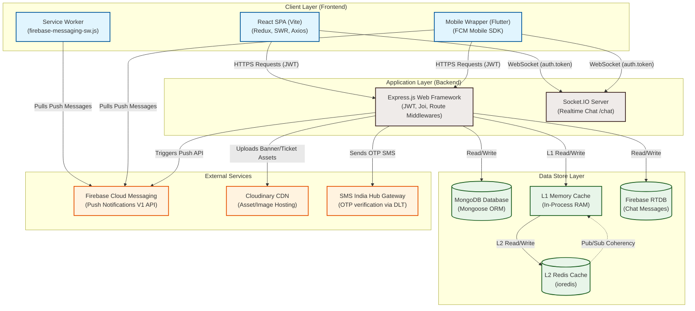
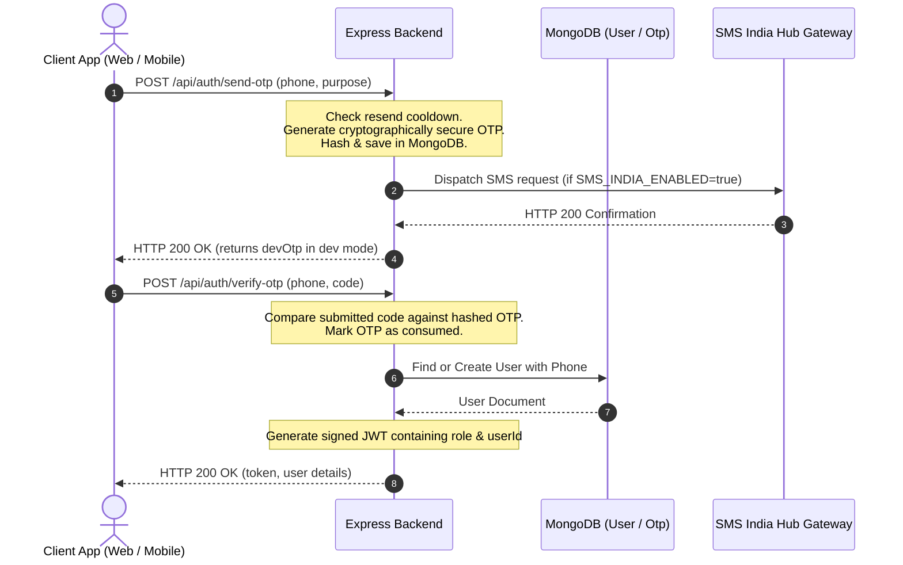
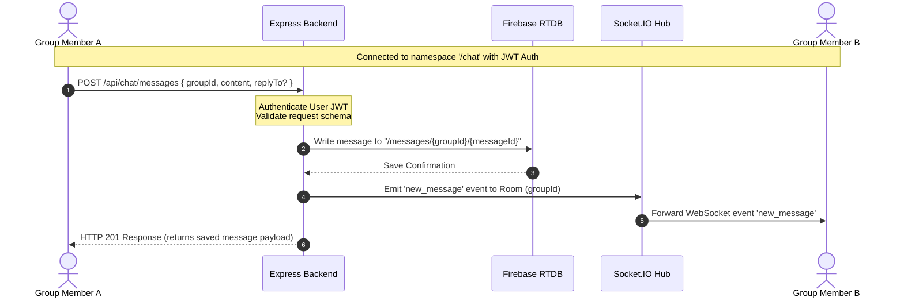
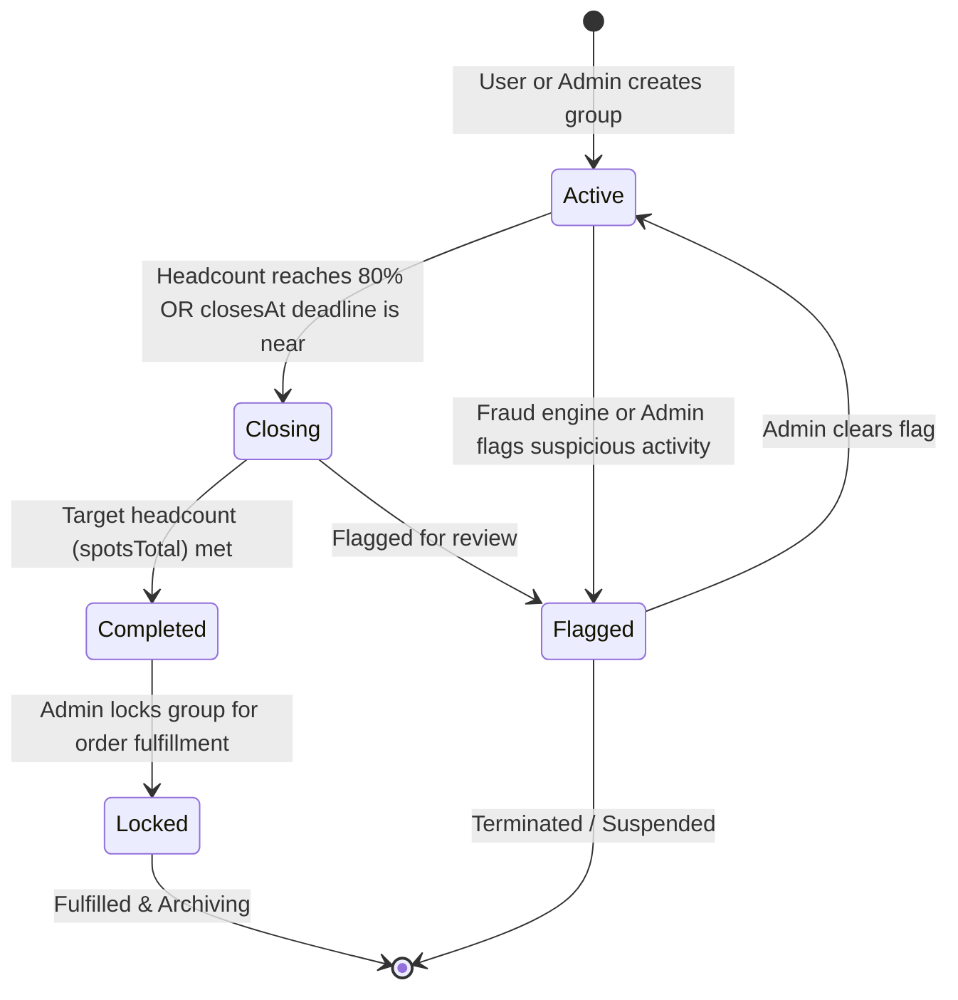
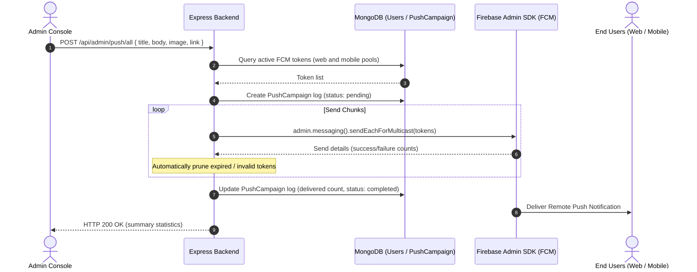
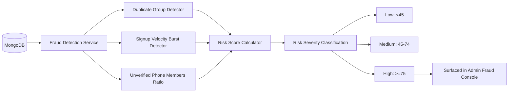

# Buy Together — System Architecture & Technical Overview

Welcome to the **Buy Together** architecture guide. This document details the end-to-end design, data flows, communication protocols, and directory structures of the Buy Together platform.

Buy Together is a social e-commerce platform that pools consumer demand to unlock discounted bulk pricing. The system supports three primary user roles:
- **End Users (Buyers):** Join and create buy-together groups to pool demand for products/deals.
- **Vendors (Sellers):** Propose deals and manage listing offers.
- **Admins (Platform Operators):** Manage categories, banners, users, vendors, support tickets, and review fraud detection metrics.

---

## 1. High-Level System Architecture

The following diagram illustrates the relationship between the client apps, API backend, databases, and third-party integrations:



---

## 2. Core Operational Workflows

Below are the sequence and state diagrams explaining how key actions propagate through the system.

### A. Authentication & Onboarding Flow
Authentication is based on Phone numbers and One-Time Passwords (OTPs) to guarantee user identity.



### B. Real-Time Chat System
Chat messages bypass MongoDB for high-write performance and are written to Firebase Realtime Database (RTDB), then broadcasted to online room members via Socket.IO.



### C. Demand-Group Lifecycle
Joint-buying groups progress through various stages as demand is pooled and verified.



### D. Push Notification Pipeline
Push notifications are broadcasted to Web (Service Worker) and Mobile (Flutter wrapper) pools.



### E. Fraud & Risk Analytics
The fraud engine runs queries against the MongoDB database and calculates risk scores (0–100) based on signals like group duplication, signup velocity, and unverified membership ratios.



---

## 3. Databases and Caching Strategy

The system balances persistent database constraints with high-performance execution through a tiered caching design:

### MongoDB (Primary Database)
- Manages relational domain documents: users, groups, deals, categories, banners, support tickets, and vendor metadata.
- Managed via **Mongoose ORM** schemas located in [backend/src/models](file:///c:/Users/AnkitAhirwar/OneDrive/Desktop/Buy%20Together/backend/src/models).

### Hybrid L1 + L2 Cache System
To reduce database load on frequently-read data (e.g. settings, content pages, banners, active categories):
1. **L1 Cache (In-Memory RAM):** Map-based cache per-node instance. Fast sub-millisecond lookups.
2. **L2 Cache (Redis - Optional):** Shared across processes, surviving server restarts. Enabled via `REDIS_URL`.
3. **Cross-Process Coherency:** When a node writes or invalidates a key via `del(key)`, it publishes an invalidation signal to Redis. All clustered Node instances listening to the Pub/Sub channel automatically invalidate their local L1 Cache, avoiding stale data conditions.

### Socket.IO Redis Adapter
To support horizontal scaling (such as multi-process PM2 clusters or multiple server instances), the backend configures `@socket.io/redis-adapter` (when Redis is enabled). Socket connections can land on separate processes, yet broadcasts (like chat updates) seamlessly bridge across workers.

---

## 4. Key Directory Structures

Here is an overview of how components are distributed within the repository:

### Backend Structure (`/backend`)
```
backend/
├── src/
│   ├── app.js               # Express application initialization & middleware stack
│   ├── server.js            # Node HTTP server wrapper, DB setup, Socket.IO bootstrapping
│   ├── config/              # Environment config schemas (Joi) and Redis/Mongo setups
│   ├── controllers/         # HTTP request handlers (routes delegators)
│   ├── integrations/        # External services wrappers (SMS India Hub, Cloudinary)
│   ├── jobs/                # Cron tasks (scheduled cleanup/group checks)
│   ├── middlewares/         # Route verification (JWT auth, Role check, Error handlers)
│   ├── models/              # Mongoose DB schemas (MongoDB definitions)
│   ├── routes/              # Express API endpoint router mapping
│   ├── services/            # Core business logic handlers (Auth, Push, Chat, Fraud)
│   ├── sockets/             # Real-time WebSocket handlers (/chat namespace)
│   ├── utils/               # Common utilities (cache management, logger, custom API error)
│   └── validations/         # Request body validation schemas (Joi)
└── tests/                   # Integration and unit tests
```

### Frontend Structure (`/frontend`)
```
frontend/
├── public/                  # Static assets and Web Push Service Worker (firebase-messaging-sw.js)
├── src/
│   ├── App.jsx              # Application router wrapper & background notification listeners
│   ├── main.jsx             # React entry point
│   ├── components/          # Reusable shared UI elements (buttons, inputs, cards)
│   ├── config/              # Public client configurations (Firebase credentials)
│   ├── constants/           # Frontend constants, roles, and status lists
│   ├── design/              # Visual templates, color schemes, and design primitives
│   ├── hooks/               # Custom React hooks
│   ├── pages/               # Multi-role sub-applications
│   │   ├── admin/           # Super-Admin console (Full-screen panels)
│   │   ├── auth/            # Client login, OTP verification, and signup screens
│   │   ├── userMain/        # Core Consumer App (Home, deals, profile, chat layouts)
│   │   └── vendor/          # Vendor-specific dashboards and offer creation
│   ├── redux/               # Global client-state management (Auth, Wishlist, Chat slices)
│   ├── routes/              # React-Router definitions (AllowedRoles client shields)
│   ├── services/            # Axios API wrappers, socket instance getters, and FCM hooks
│   └── utils/               # Frontend formatting & coordinate distance sorting helpers
└── vite.config.js           # Vite development and bundling configuration
```

---

## 5. Security & Validation Checklist

- **Secure HTTP Headers:** Enabled via `helmet` in the Express pipeline.
- **Request Compression:** Enabled via `compression` middleware to optimize JSON payloads.
- **API Request Validation:** Every input schema is validated on entry by **Joi** middlewares before executing controllers.
- **CORS Configuration:** Explicit configurations are used with `maxAge` preflight caching.
- **Authentication Shields:** Protected API routes and websocket handshakes require a valid bearer JWT. Allowed Roles (`user`, `vendor`, `admin`) are strictly enforced.
